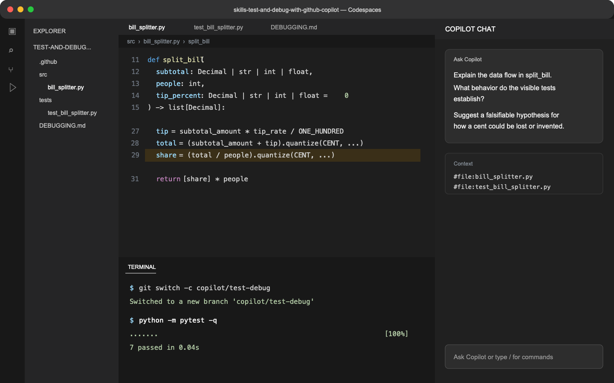

## Step 1: Investigate before changing code

The FairShare team has a bill splitter that passes its current tests, but a customer says some group totals are off by a cent. Resist the urge to ask Copilot for a fix immediately.

### 📖 Theory: Evidence before edits

Copilot is useful for explaining unfamiliar code and suggesting hypotheses. Its explanation is not proof. A reliable debugging loop starts by understanding the contract, running the baseline, and recording a falsifiable hypothesis that a test can confirm or reject.

> [!IMPORTANT]
> In this exercise, Copilot is a partner, not an authority. Keep suggestions only after you can connect them to code, test output, or an invariant.

### ⌨️ Activity: Explain the code and form a hypothesis



1. In the **GitHub web UI**, open the exercise issue that contains this comment.

1. In the **GitHub web UI**, select **Code** > **Codespaces** > **Create codespace on main**. Wait for VS Code to open.

1. In the **Codespace terminal**, create and switch to the required branch:

   ```bash
   git switch -c copilot/test-debug
   ```

1. In the **Codespace editor**, open `src/bill_splitter.py`, `tests/test_bill_splitter.py`, and `DEBUGGING.md`.

1. In **Copilot Chat**, ask Copilot to explain the data flow in `split_bill`, identify the behavior the visible tests establish, and suggest a hypothesis for how a cent could be lost or invented. Ask for reasoning, not a code change.

1. In the **Codespace terminal**, establish the baseline:

   ```bash
   python -m pytest -q
   ```

1. In the **Codespace editor**, replace every placeholder in `DEBUGGING.md`. Describe the code in your own words, record the baseline command and result, and write a specific hypothesis that a test could disprove.

1. In the **Codespace terminal**, commit and push your notes:

   ```bash
   git add DEBUGGING.md
   git commit -m "Document bill splitter hypothesis"
   git push -u origin copilot/test-debug
   ```

   Mona will check your branch and notes, then post the next step in the exercise issue.

<details>
<summary>Having trouble? 🤷</summary><br/>

- If dependencies are not ready, run `python -m pip install -r requirements.txt`.
- A useful hypothesis names a suspicious operation and predicts which input shape will expose it.
- If grading fails, update `DEBUGGING.md`, commit, and push again on the same branch.

</details>
