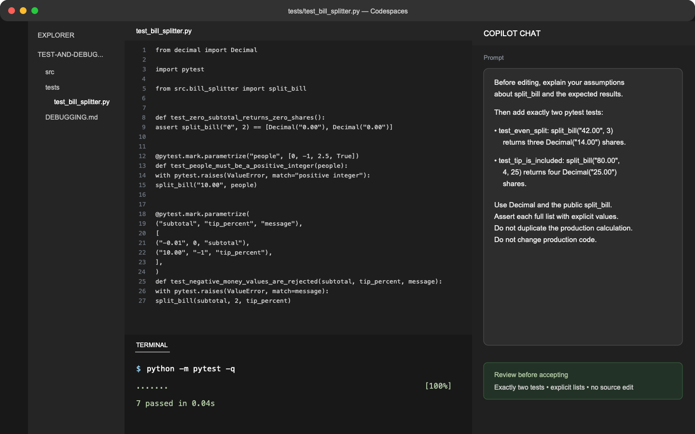

## Step 2: Generate focused tests from behavior

Your hypothesis is useful only if tests can challenge it. Start with clear, ordinary examples before reaching for edge cases.

### 📖 Theory: Prompt with a contract

Tests generated from vague prompts often mirror the implementation instead of checking useful behavior. Give Copilot explicit inputs, outputs, names, and constraints. Then read each assertion: a test that passes is valuable only when it proves something intentional.

### ⌨️ Activity: Add two focused unit tests



1. In the **Codespace editor**, open `tests/test_bill_splitter.py`.

1. In **Copilot Chat**, paste this prompt:

   ```text
   Before editing, explain your assumptions about the split_bill API and these expected results. Then add exactly two pytest tests to tests/test_bill_splitter.py:

   - test_even_split: split_bill("42.00", 3) returns three Decimal("14.00") shares.
   - test_tip_is_included: split_bill("80.00", 4, 25) returns four Decimal("25.00") shares.

   Use Decimal from Python's decimal module and the public split_bill function. Assert each complete returned list with explicit expected values; do not duplicate the production calculation. Do not change production code.
   ```

1. In the **Codespace editor**, inspect Copilot's proposed tests before accepting them. Confirm that each test has one clear reason to fail and asserts the complete returned list.

1. In the **Codespace terminal**, run the tests:

   ```bash
   python -m pytest -q
   ```

1. In the **Codespace terminal**, commit and push only after the full suite passes:

   ```bash
   git add tests/test_bill_splitter.py
   git commit -m "Add focused bill splitting tests"
   git push
   ```

   Mona will verify the named behaviors and prepare the edge-case investigation.

<details>
<summary>Having trouble? 🤷</summary><br/>

- Import `Decimal` from Python's `decimal` module.
- Keep the exact test names so the grader can give focused feedback.
- If a generated test computes its expected result with the same formula as the production code, replace that calculation with an explicit expected value.

</details>
