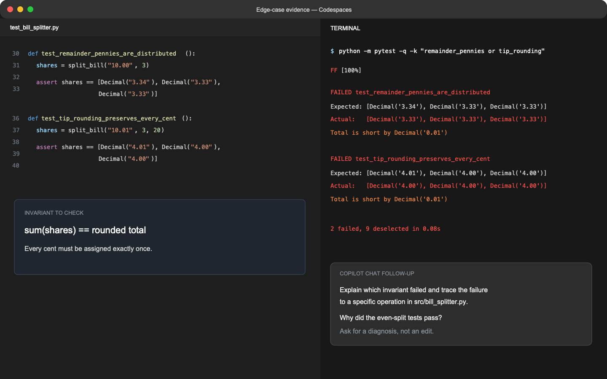

## Step 3: Challenge the generated tests

The new tests pass, but they divide evenly. That leaves the customer's report unexplained. Your job is to find what the happy-path tests missed.

### 📖 Theory: Test invariants and boundaries

Generated tests frequently overrepresent common inputs. Add cases around rounding, boundaries, invalid data, and invariants. For this library, the key invariant is: **the shares must add up to the rounded total, down to the cent**.

### ⌨️ Activity: Add edge cases that expose the bug



1. In **Copilot Chat**, ask for likely edge cases in money splitting. Compare the suggestions with your hypothesis in `DEBUGGING.md`; do not accept the list blindly.

1. In the **Codespace editor**, add these two tests to `tests/test_bill_splitter.py`:

   - `test_remainder_pennies_are_distributed`: `$10.00` split among 3 people returns `[Decimal("3.34"), Decimal("3.33"), Decimal("3.33")]`.
   - `test_tip_rounding_preserves_every_cent`: `$10.01` with a 20% tip split among 3 people returns `[Decimal("4.01"), Decimal("4.00"), Decimal("4.00")]`.

1. In the **Codespace terminal**, run only the new tests and read the failure details:

   ```bash
   python -m pytest -q -k "remainder_pennies or tip_rounding"
   ```

1. In **Copilot Chat**, paste or reference the failure output. Ask Copilot to explain which invariant failed and trace the failure back to a specific operation in `src/bill_splitter.py`. Do not ask it to edit the code yet.

1. In the **Codespace editor**, verify Copilot's diagnosis against the implementation. A convincing diagnosis should explain both the observed output and why the even-split tests passed.

1. In the **Codespace terminal**, commit and push the intentionally failing tests:

   ```bash
   git add tests/test_bill_splitter.py
   git commit -m "Expose remainder penny edge cases"
   git push
   ```

   This step expects those tests to fail against the original bug. Mona uses a known-buggy fixture, so grading still works if you experimented locally.

<details>
<summary>Having trouble? 🤷</summary><br/>

- Do not weaken the expected lists to match the buggy output.
- If no tests are selected, check the exact function names and your `-k` expression.
- A failing test is useful evidence, not a failed exercise step.

</details>
