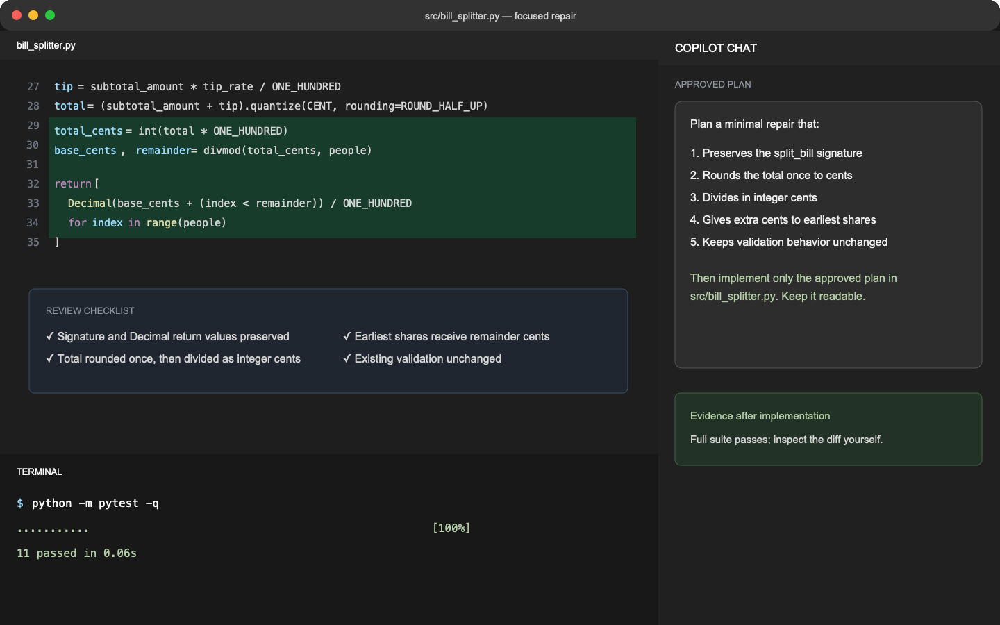

## Step 4: Fix the cause, then refactor

You now have a reproducible failure and a root-cause hypothesis. Make the smallest correct change, then improve clarity while the tests protect behavior.

### 📖 Theory: Preserve the invariant

Rounding each person's share independently can lose or invent money. A robust approach converts the rounded total to integer cents, uses quotient and remainder division, and distributes any leftover cents deterministically. Refactoring comes after correctness, with the same tests still passing.

### ⌨️ Activity: Repair and simplify the implementation



1. In **Copilot Chat**, provide `src/bill_splitter.py`, the two failing tests, and the diagnosis from the previous step. Ask for a plan that:

   - preserves the `split_bill` signature and `Decimal` return values,
   - rounds the total bill once to cents,
   - divides in integer cents,
   - gives one extra cent to the earliest shares until the remainder is exhausted,
   - keeps the existing validation behavior.

1. In the **Codespace editor**, review the plan before asking Copilot to implement it. Reject changes that weaken tests, change expected values, or add unrelated dependencies.

1. In **Copilot Chat**, ask Copilot to implement the approved plan in `src/bill_splitter.py` and keep the code readable.

1. In the **Codespace terminal**, run the complete suite:

   ```bash
   python -m pytest -q
   ```

1. In the **Codespace editor**, inspect the diff. Confirm that the public contract is unchanged and every returned share has exactly two decimal places.

1. In the **Codespace terminal**, commit and push the implementation:

   ```bash
   git add src/bill_splitter.py
   git commit -m "Preserve cents when splitting bills"
   git push
   ```

   Mona will run visible and additional grading tests before posting the final review step.

<details>
<summary>Having trouble? 🤷</summary><br/>

- `divmod(total_cents, people)` returns both the base share and leftover cents.
- Avoid binary floating-point arithmetic; normalize inputs with `Decimal(str(value))`.
- Do not edit `.github/grading/test_solution.py`. It represents behavior beyond the visible examples.

</details>
