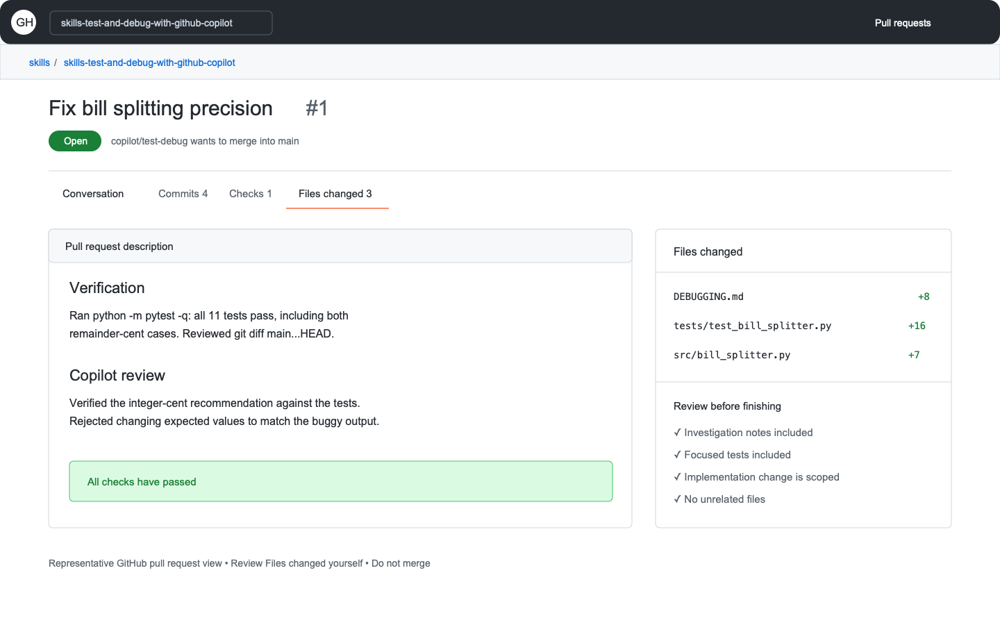

## Step 5: Review the evidence

The tests pass, but passing tests alone do not prove that every Copilot suggestion was appropriate. Finish with a human review of the change and its evidence.

### 📖 Theory: Verification is part of the work

AI-assisted code should receive the same review as any other code. Inspect the diff, connect each change to a requirement, run the relevant checks, and document what you verified independently. This step uses standard pull request features and does not require Copilot code review or a paid organization feature.

### ⌨️ Activity: Open and review the pull request



1. In the **Codespace terminal**, inspect the final diff and rerun all tests:

   ```bash
   git diff main...HEAD
   python -m pytest -q
   ```

1. In **Copilot Chat**, ask Copilot to review the diff for correctness, untested assumptions, and unnecessary complexity. Treat the response as another hypothesis: check every claim against the code and tests.

1. In the **GitHub web UI**, open a pull request from `copilot/test-debug` into `main` with the title `Fix bill splitting precision`.

1. In the **GitHub web UI**, include both of these headings in the pull request description:

   ```markdown
   ## Verification
   <!-- State the commands you ran and the behavior they proved. -->

   ## Copilot review
   <!-- Describe one Copilot suggestion you verified, revised, or rejected and why. -->
   ```

1. In the **GitHub web UI**, review the **Files changed** tab yourself. Confirm that the diff contains the investigation notes, tests, and focused implementation fix without unrelated changes.

1. Wait for Mona to grade the pull request. You do not need to merge it to complete the exercise.

<details>
<summary>Having trouble? 🤷</summary><br/>

- If the workflow reports a missing section, edit and save the pull request description to retrigger grading.
- Write concrete evidence under each heading; a heading by itself does not show critical review.
- If tests fail, return to the Codespace, fix the issue, and push. The pull request will update automatically.

</details>
